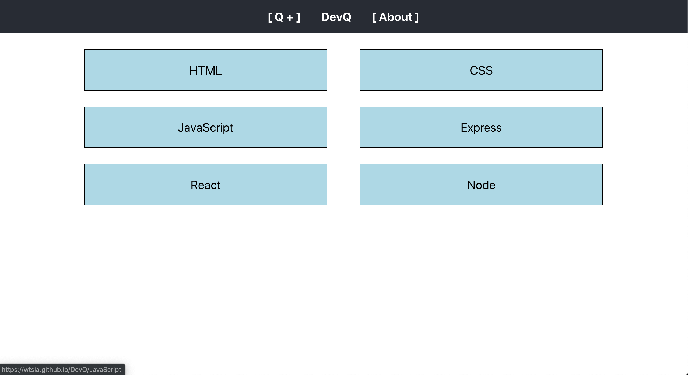

<h1>DevQ</h1>

## Description:

DevQ is a study platform for Software Engineers. Users can choose from a variety of languages to study, where they will then be prompted with a question, an input section to note their answer, a hint, an answer, and a link to further documentation. Further, users can add their own questions to existing languages, edit questions, and delete questions.

## Planning & Examples:

<!-- ; -->

## Current Features:

Starting with the DevQ navigation, users can route to the home page clicking on "DevQ", to the add new question page with "Q+", and the about page with "About". The body consists of links to various categories of questions, which will then take users to the question page; the question page will dynamically fill with questions matching that type, with an input to note their answer, a hint, an answer, and a link to an addtional resource for continued reading. On this page, users can choose to edit the question, which will direct them to the edit page; on the edit page, users will then re-enter the information for the question with any edits they wish to make, with the option to delete the question altogether. To creat new questions, users can click on the "Q+", which will direct them to the new question page. On this page, users will enter the question, hint, answer, a link to additional resources, and question type, with all inputs being required. Submitting the question will push them to the database, where they will then be requested and displayed in their respective category types when the user goes back to questions.

## Features in Progress:

Features in progress include adding a customizeable timer to each question, adding a toggle feature to hide and display hints and answers, and the ability to edit questions without requiring users to re-enter the question data.

## Technologies Used:

- HTML
- CSS
- JavaScript
- React
- Express
- Node
- Mongoose
- Heroku
- GitHub

## Additional Resources:

## Installation Instructions:

https://wtsia.github.io/DevQ/

## Contribution Guidelines:

Frontend: https://github.com/wtsia/DevQ/
Backend: https://github.com/wtsia/Project3-Backend
